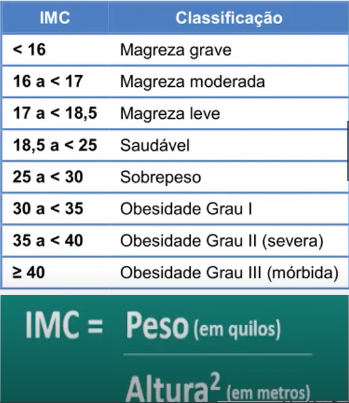
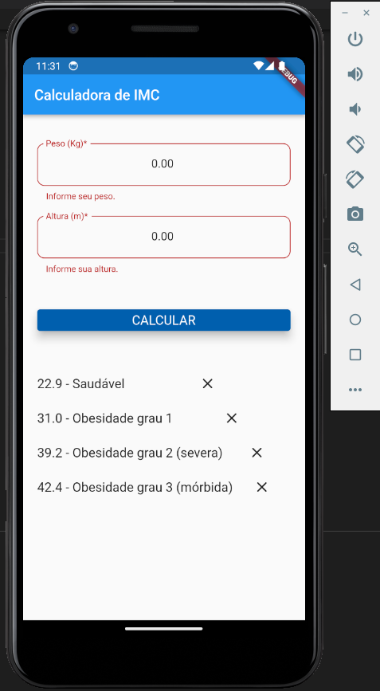

## Bootcamp Santander Dio - Desafio Calculadora de IMC

* Conforme tabela abaixo realizar o cálculo e mostrar no terminal a informação sobre o IMC do usuário.

### Checklist do Desafio
* Criar classe IMC (Peso / Altura)​
* Ler dados
* Calcular IMC ​
* Exibir listagem

